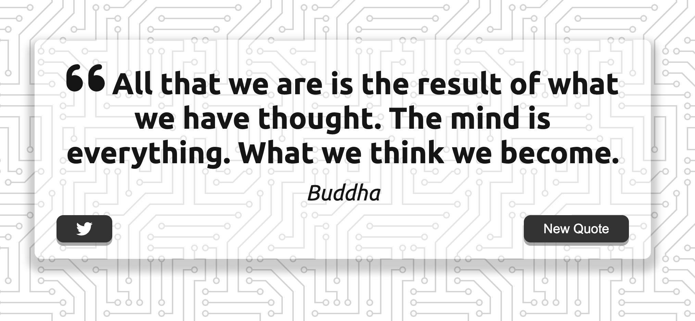

# Random Quote Generator - Zero To Mastery JS Project

This is a solution to a Zero To Mastery JavaScript Web Project.

## Overview

Users should be able to:

- View a random quote upon page load
- Get a new quote by selecting the 'New Quote' button
- Generate a tweet with the current quote and author when selecting the Twitter button

### Screenshot

### Built with 

- Vanilla JavaScript
- Flexbox
- [Inspirational Quote API](https://quotes-react.netlify.app/)